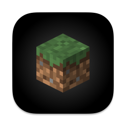
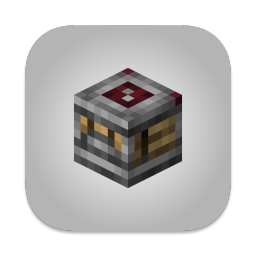

# Icon

A simple mod that allows the Minecraft icon to be changed via resource packs

*For modpack makers*: you may use this mod in your modpack with or without credit

## Using

This mod supports only Windows, macOS, and X11 desktops.

Download a resource pack that provides icons, and enable it. Once the resources finish reloading, you should see that the icon in the dock/taskbar has changed.

This mod comes with a default resource pack called Alternate Icons. It's disabled by default, but you can enable it in the resource pack screen.


*The release icon from Alternate Icons*


*The snapshot icon from Alternate Icons*

## Creating Resource Packs

These are the required files:

```
my_resource_pack
|- icons
   |- icon_16x16.png
   |- icon_32x32.png
   |- icon_48x48.png
   |- icon_128x128.png
   |- icon_256x256.png
   |- minecraft.icns
   |- snapshot
      |- icon_16x16.png
      |- icon_32x32.png
      |- icon_48x48.png
      |- icon_128x128.png
      |- icon_256x256.png
      |- minecraft.icns
```
